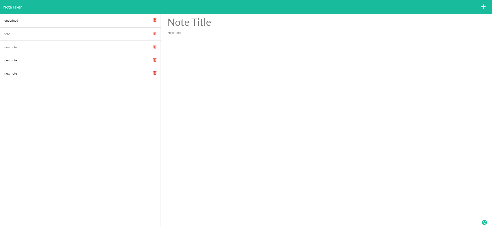

# Note Taker Starter Code

## Table of Contents

-[Description](#Description)

-[Programming Languages, Technologies/Frameworks](#Programming-Languages,-Technologies/Frameworks)

-[Installation](#Installation)

-[Contribution](#Contribution)

-[URL](#URL)

## Description

Refactored code for an application called Note Taker that can be used to write, save, and delete notes. This application will use an Express.js back end and will save and retrieve note data from a JSON file

## Programming Languages, Technologies/Frameworks

- Javascript
- HTML
- Css
- Express.js
- Node.js
- Heroku

## Installation

1. Npm i express
1. npm start
1. open on http://localhost:3001/

## Contribution

true

### Screenshots

### URL of the deployed Heroku Site:

<https://pacific-crag-41386.herokuapp.com/>
